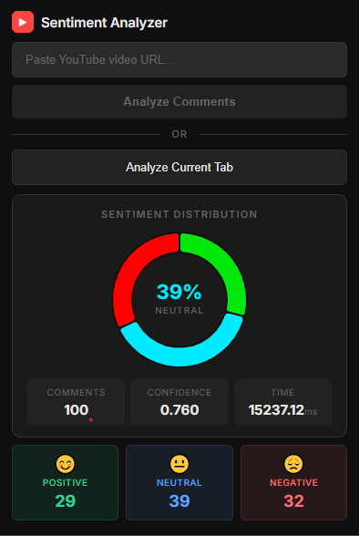

# 🎬 YT Comment Analyzer

A Chrome extension that analyzes the sentiment of YouTube video comments in real-time using a fine-tuned DistilBERT model.

> Paste a YouTube URL → fetch comments → get instant sentiment breakdown.

---

## Preview

<p align="center">
  
</p>

## Tech Stack

| Layer | Tech |
|-------|------|
| **Extension** | React · Vite · Chart.js |
| **Backend** | FastAPI · Python |
| **Model** | DistilBERT (fine-tuned) · HuggingFace Transformers |


## Project Structure

```
YT-Comment-Analyzer/
├── backend/
│   ├── .env
│   ├── app.py
│   ├── requirements.txt
│   └── model/
│       └── final_model/
│           ├── config.json
│           ├── model.safetensors
│           ├── tokenizer_config.json
│           └── tokenizer.json
├── extension/
│   ├── public/
│   │   ├── background.js
│   │   ├── manifest.json
│   │   └── icons/
│   ├── src/
│   │   ├── components/
│   │   │   ├── Popup.jsx
│   │   │   ├── VideoInput.jsx
│   │   │   └── SentimentChart.jsx
│   │   ├── api/
│   │   │   └── sentiment.js
│   │   ├── utils/
│   │   │   └── youtube.js
│   │   ├── App.jsx
│   │   ├── main.jsx
│   │   └── styles.css
│   ├── .env
│   ├── icongen.cjs
│   ├── package.json
│   └── vite.config.js
└── README.md
```

## Setup

### 1. Download the Model

Download `model.safetensors` from:
```
https://huggingface.co/Adhi-3947-AI/yt-comment-sentiment-distilbert/tree/main
```

Place it inside `backend/model/final_model/` with the config files. Must have model artifacts:
```md
    backend\model\final_model\config.json
    backend\model\final_model\model.safetensors
    backend\model\final_model\tokenizer_config.json
    backend\model\final_model\tokenizer.json
```

### 2. Backend

```bash
cd backend
pip install -r requirements.txt
uvicorn main:app --reload
```

Server starts at `http://localhost:8000`.

### 3. Extension

```bash
cd extension
npm install
```

**Generate icons:**

```bash
cd extension
node icongen.cjs
```

**Build:**

```bash
npm run build
```

### 4. Load in Chrome

1. Open `chrome://extensions`
2. Enable **Developer mode**
3. Click **Load unpacked**
4. Select the `extension/dist` folder


## Environment

Create `extension/.env`:

```env
VITE_BACKEND_URL=http://localhost:8000
```

## How It Works

1. **Input:** Paste a YouTube URL or click "Analyze Current Tab"
2. **Fetch:** Backend pulls comments via YouTube Data API
3. **Predict:** DistilBERT classifies each comment as Positive, Neutral, or Negative
4. **Display:** Extension shows a doughnut chart + sentiment breakdown

Analysis runs in a **background service worker** — closing the popup won't interrupt it.

## Model Performance

Trained on **300K** YouTube comments (100K per each class) · Evaluated on a **30K** held-out test set.

| Metric | Score |
|--------|-------|
| **Accuracy** | 72.56% |
| **Macro F1** | 72.64% |
| **Macro Precision** | 72.83% |
| **Macro Recall** | 72.56% |

| Class | Precision | Recall | F1 |
|-------|-----------|--------|----|
| Positive | 0.78 | 0.75 | 0.76 |
| Neutral | 0.66 | 0.71 | 0.69 |
| Negative | 0.74 | 0.72 | 0.73 |

- **Base model:** `distilbert-base-uncased`.
- **Fine-tuned:** 5 epochs · cosine LR schedule · label smoothing (0.1)
- **To improve:** 
    - Try a stronger base model like `bert-base-uncased` or `roberta-base` (only if size doesn't matter).
    - Remove/ reduce `label_smoothing_factor`.
    - Use a lower `learning_rate` (e.g., 1e-5) with more epochs.
---